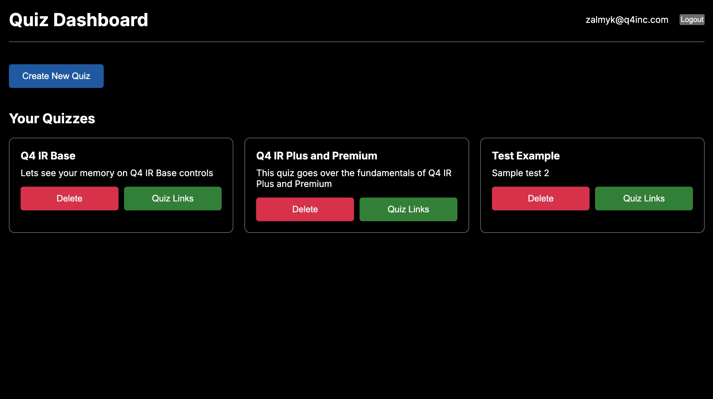

This is a super simple quiz app I built in order to satisfy the needs of having a quick quiz app that allows for context added in between questions. 

The goal is to have a quiz that can be taken by anyone with a link, but also have a dashboard for creating quizzes and managing them and setting the context for each question. 



## Getting Started

First, run the development server:

```bash
npm install
npm run dev 
```

Open [http://localhost:3000](http://localhost:3000) with your browser to see the result.
 
Keep in mind this uses mongoDB so you will need to have that running locally or have a remote instance. Models are in the models dir. 